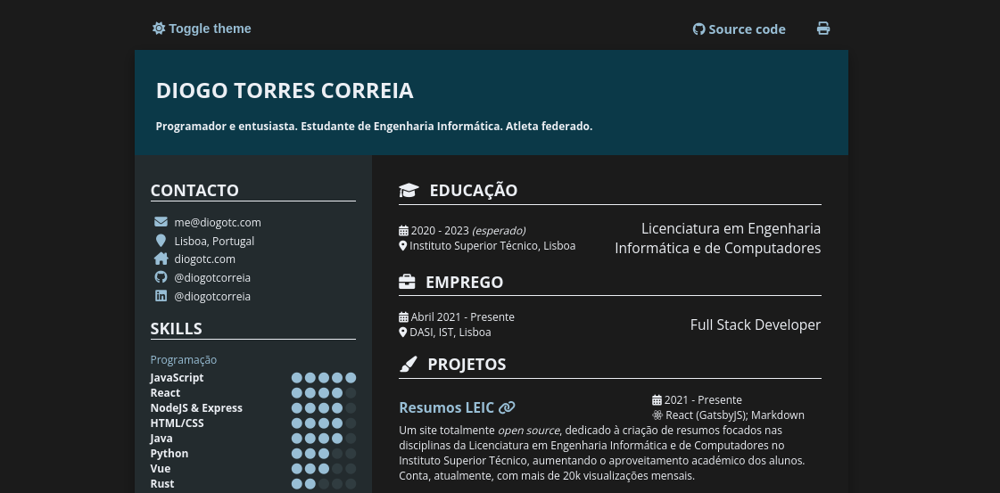

# Curriculum Vitae - Diogo Correia

Why HTML? Because it can be easily [shared on the web](https://cv.diogotc.com)



## Project Structure

The content itself can be found at `data/content.yaml`.
HTML template files are located inside the `layouts` directory.

## Running Locally

You must install [Hugo](https://gohugo.io/) and then run

```
hugo server -D
```

Additionally, to install formatting dependencies, run

```
npm install
npm run format # run formatter
```

## Building to Production

To build for production with minification, run

```
hugo -D --gc --minify
```

## Printing to PDF

Sometimes it might be desirable to print to a page longer than A4,
as to avoid a page break.
A workaround is to print to PDF as an A2 and then use Ghostscript to
crop the resulting PDF.

```sh
# Change $HEIGHT to the amount to crop from the bottom
gs -o out.pdf -sDEVICE=pdfwrite -c "[/CropBox [297.78 1684.08 893.34 $HEIGHT] /PAGES pdfmark" -f CV\ _\ Diogo\ Correia.pdf
```
